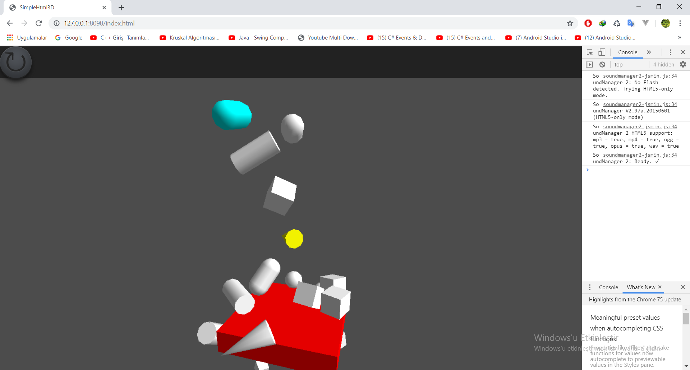

# Bullet library for Java and Gwt with Libgdx example

This library written in pure java

Instructions

Compile gdxBulletGwt project and package in jar with sources and add Demo project libs folder

Add your GdxDefinition.gwt.xml \<inherits name='BulletPhysics' />

